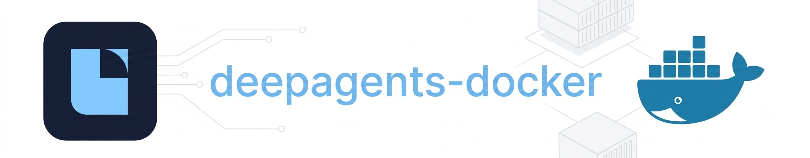

<p align="center">
  
</p>
<div align="center">
  <h3>Docker sandbox backend for <a href="https://github.com/langchain-ai/deepagents">Deep Agents</a>.</h3>
</div>


<div align="center">

[](LICENSE)
[](https://www.python.org/downloads/)
[](https://github.com/langchain-ai/deepagents)

</div>


## Quickstart

Requires [Docker](https://docs.docker.com/get-docker/) on your machine.

Install with `uv`:
```bash
uv add deepagents-docker
```
or with `pip`:
```bash
pip install deepagents-docker
```

```python
from deepagents import create_deep_agent
from deepagents_docker import DockerSandbox

agent = create_deep_agent(
    model="openai:gpt-5.5",
    backend=DockerSandbox(),
    system_prompt="You are a research assistant.",
)

result = agent.invoke({"messages": "Research the latest trends in AI and write a summary."})
```

## Configuration

Constructor options let you change the image, workspace path, command timeout, resource limits, outbound network access, and any extra `docker run` flags:

```python
DockerSandbox(
    image="python:3.12-bookworm",      # default image (Debian-based, includes curl, etc.)
    allow_outbound_traffic=True,       # False → no network; True (default) → allow outbound traffic
    workspace_dir="/path/to/project",  # host dir for agent files; see note below
    timeout=120,                       # per-command timeout (seconds)
    max_output_bytes=100_000,          # combined stdout/stderr cap per command
    memory="512m",
    cpus=1.0,
    pids_limit=128,
    auto_remove=True,                  # remove container on close()
    extra_run_args=["--env", "FOO=bar"],
)
```

> [!NOTE]
> When `workspace_dir` is omitted, a temporary directory is created under the host temp folder and **removed on `close()`** when the sandbox owns it. Pass an explicit path to keep files after the container stops.


## How it works

`DockerSandbox` implements the Deep Agents backend protocol by splitting work across the host and a container:

- **File tools** (`read`, `write`, `edit`, `grep`, `glob`, `ls`) run against a workspace directory on your machine.
- **`execute`** runs shell commands in a long-lived Docker container. The same directory is bind-mounted at `/workspace`, so files stay in sync between tools and commands.

On startup, the sandbox creates a container with conservative defaults:

- [`python:3.12-bookworm`](https://hub.docker.com/_/python) as the default image
- Outbound traffic allowed by default
- No elevated Linux privileges
- Read-only root filesystem (with small `tmpfs` mounts for `/tmp` and `/var/tmp`)
- Memory, CPU, and PID limits


> [!NOTE]
> The container is stopped and removed automatically when the Python process exits (`atexit`). Use a context manager (below) to tear down earlier.


### Using a context manager

Use a context manager when you want the container stopped and removed as soon as you leave the block:

```python
from deepagents import create_deep_agent
from deepagents_docker import DockerSandbox

with DockerSandbox() as backend:
    agent = create_deep_agent(model="openai:gpt-5.5", backend=backend)
    agent.invoke({"messages": "..."})

# Container stopped and removed here.
print("Done!")
```

## Development

```bash
git clone https://github.com/andybbruno/deepagents-docker.git
cd deepagents-docker
uv sync
uv run pytest
```

## Security

Use this for trusted workloads and development, not as a hard multi-tenant boundary. Do not put secrets in the workspace. See [Deep Agents security](https://github.com/langchain-ai/deepagents?tab=security-ov-file).

## License

MIT — [LICENSE](LICENSE).
